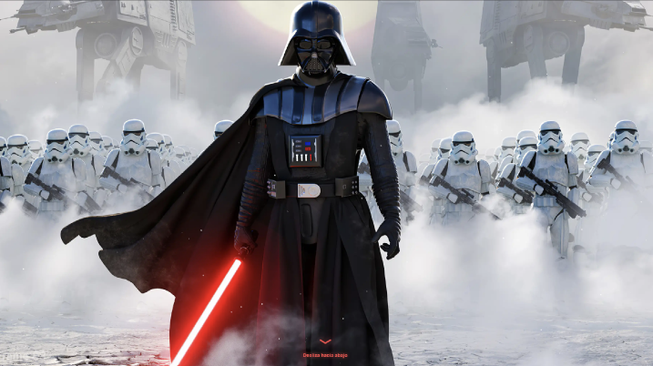
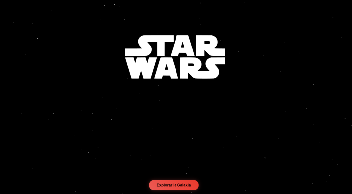

# Proyecto Web Star Wars - Consumo de API

Este proyecto es una landing page acerca de **[Star Wars]**, diseñada con el fin de gestionar personajes, naves y planetas del universo Star Wars, permitiendo a los usuarios explorar, buscar y administrar información detallada.

## 🌐 Demo en línea
Puedes ver el portafolio publicado en GitHub Pages aquí:
👉 https://deamacevedo.github.io/Star-Wars-JD/

Incluye las siguientes características generales:
- Gestión integral de personajes, naves, planetas y especies del universo Star Wars.
- Búsqueda y filtrado avanzado por nombre, tipo, atributos y relaciones entre entidades.

## Tabla de Contenidos

- Maquetación en Figma
- Diseño visual
- Estructura del proyecto
- Tecnologías utilizadas
- Cómo ejecutarlo
- Caracteristica principales
- Notas
- Autores
- Recursos adicionales

## 🎨 Maquetación en Figma

El diseño visual de la landing page se elaboró previamente en Figma, estableciendo la paleta de colores, la estructura principal, la organización de las secciones y el estilo gráfico del contenido.


**Puedes ver el diseño en el siguiente enlace:**  
[Ver diseño en Figma](https://www.figma.com/design/uUb9xGnJEVGRj6UMppDRrc/Star-Wars-API?node-id=0-1&t=YzKVZ7lMmryCoIXR-1)

> 🔽 Aquí tienes algunas imágenes del diseño creado en Figma:






## 📁 Estructura del Proyecto

assets/
├── Backstar/
├── img/
Images/
├── especies/
├── naves/
├── peliculas/
├── personajes/
├── planetas/
├── vehiculos/
index.html
ReadMe.md
main.js    
styles.css      


- **Assets/**: Contiene los componentes reutilizables de la interfaz de usuario.
- **main.js**: Archivo central encargado de coordinar el funcionamiento general de la aplicación.


## ⚙️ Tecnologías utilizadas

- **JavaScript (ES6+)**
- **CSS Modules / Styled Components**: Utilizados para aplicar estilos a los componentes de manera modular y reutilizable.
- **Axios o Fetch API**: Empleados para gestionar las solicitudes HTTP a servicios externos.
- **Figma**: Herramienta empleada para la creación y prototipado del diseño visual.
- **Git & GitHub**: Usados para el control de versiones y la colaboración en el desarrollo del proyecto.


## 🚀 ¿Cómo ejecutarlo?

1. Clona el repositorio:
    ```bash
    git clone https://github.com/tu-usuario/star-wars-web.git
    ```
2. Instala las dependencias:
    ```bash
    cd star-wars-web
    npm install
    ```
3. Inicia la aplicación en modo desarrollo:
    ```bash
    npm start
    ```
4. Abre [http://localhost:3000](http://localhost:3000) en tu navegador para ver el proyecto.

---

## 📦 Caracteristicas principales

- **Exploración de personajes, naves y planetas:** Permite visualizar información detallada de cada entidad del universo Star Wars.
- **Búsqueda avanzada:** Filtra resultados por nombre, tipo, atributos y relaciones entre entidades.
- **Interfaz responsiva:** Adaptada para dispositivos móviles y de escritorio, garantizando una experiencia de usuario óptima.
- **Integración con SWAPI:** Obtiene datos en tiempo real desde la API pública de Star Wars.
- **Visualización multimedia:** Incluye imágenes y descripciones enriquecidas para cada elemento.
- **Accesibilidad:** Cumple con buenas prácticas para facilitar el acceso a usuarios con diferentes capacidades.


## 📝 Notas

- Este proyecto está destinado únicamente a propósitos educativos y de aprendizaje.

---

## 👨‍💻 Autores

- **Dyaln Acevedo** - [@Deamacevedo](https://github.com/Deamacevedo)
- **Jeferson López** - [@jefersonperez](https://github.com/Jefersonlopezr)


## 📚 Recursos adicionales

- [Documentación oficial de SWAPI](https://swapi.dev/documentation)

